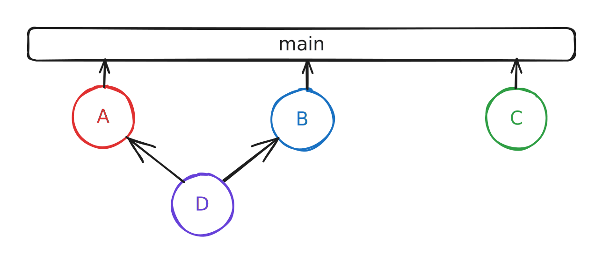

# Parallel queues

Normally, a merge queue behaves by enqueueing all submitted pull requests into a single line. Under this mode of operation, every pull request is [predictively tested ](/broken/pages/BAKgbuxqWos5o4kna99T)against the pull requests ahead of it. While this guarantees the correctness of the protected branch at all times, under a high submission load, the wait time for an item in the queue can be negatively impacted.\
\
A regular merge queue operates like a grocery store with only a single checkout lane. When a lot of folks are trying to checkout at the same time - the line will grow (sometimes intolerably). With a dynamic parallel queue, trunk merge creates additional checkout lanes in real-time while still guaranteeing that the protected branch doesn't break.​ 


track impacted code of each pull request to create dynamic queues


For example, the following four pull requests:

* PR A with impacted target list `[ frontend ]`
* PR B with impacted target list `[ backend ]`
* PR C with impacted target list `[ frontend, backend]`
* PR D with impacted target list `[ docs]`

Without parallelization, the PRs **A**, **B**, **C**, and **D** would all be tested in a single predictive path **A** <- **B** <- **C** <- **D**. Using the impacted target information we can instead build three dynamically provisioned queues and the predictive testing can yield higher throughput - which means your pull request spends less time in the queue stuck testing with unrelated code changes.

#### **How does it work?**

To run in parallel mode, each pull request needs to be inspected for its impacted targets. This is a fancy way of saying that each pull request needs to report what parts of the codebase are changing.\
\
In the example above, the pull requests **A**, **B**, and **D** can be tested in isolation since they affect distinct targets - `backend`, `frontend` and `docs`. The **C** pull request affects both `frontend` and `backend` and would be tested predictively with the changes in both **A** and **B**.\
\
To understand the interactions or dependent changes between pull requests, Trunk Merge Queue provides an API for posting the list of **impacted targets** that result from code changes in every PR. When Trunk Merge Queue is running in parallel mode, pull requests will not be processed until the list of impacted targets are uploaded.

#### **What are Impacted Targets?**

Impacted targets are metadata that describe the logical changes of a pull request. An impacted target is a string that can be as expressive as a Bazel target or the name of a file folder. Calculating impacted targets with a purpose-built build system will provide absolute correctness for the merge queue, but more lightweight glob or folder-based approaches can also work with fewer guarantees around correctness.

#### **Posting impacted targets from your pull requests**

We ship several pre-built solutions for popular build systems to automatically calculate and post the impacted targets of a pull request. If you are using another build system, we would be happy to work with you to add support for your specific build system.

<table data-column-title-hidden data-view="cards"><thead><tr><th></th><th data-hidden></th><th data-hidden></th><th data-hidden data-card-cover data-type="files"></th><th data-hidden data-card-target data-type="content-ref"></th></tr></thead><tbody><tr><td><strong>Bazel</strong></td><td></td><td></td><td><a href="../../../.gitbook/assets/bazel-dark.png">bazel-dark.png</a></td><td><a href="bazel.md">bazel.md</a></td></tr><tr><td><strong>Nx</strong></td><td></td><td></td><td><a href="../../../.gitbook/assets/NX.png">NX.png</a></td><td><a href="nx.md">nx.md</a></td></tr><tr><td><strong>Other</strong></td><td></td><td></td><td><a href="../../../.gitbook/assets/Group 1277.png">Group 1277.png</a></td><td><a href="api.md">api.md</a></td></tr></tbody></table>

**Enable Parallel Modes**\
Merge can be swapped between `Single` and `Parallel` mode at any time. If there are no PRs in the merge queue when switching, the switch will be immediate. If there are PRs in the queue, then Merge will go into the `Switching Modes` state, where it'll wait for all currently testing PRs to merge before switching modes. During this time, PRs will not be able to enter the queue.

Switching modes can be done from the `Merge Queue Mode` section of the `Settings > Repositories > repo name > Merge` panel

<figure><figcaption>
enabling parallel mode
</figcaption></figure>

**Find your Trunk API Token**



#### Store your Organization Token as a GitHub Secret



### Monitoring Parallel Queue Performance

Once you've enabled parallel mode and configured impacted targets, you can analyze how well the parallel workflow performs for different parts of your codebase.

The Health dashboard allows you to filter all metrics by impacted targets, so you can:

* Compare merge times between different targets (e.g., frontend vs backend)
* Identify which targets experience the most failures
* Optimize queue configuration for your highest-priority code paths
* Demonstrate the value of parallel mode to engineering leadership


See [Filter Metrics by Impacted Targets ](../../administration/metrics.md#filter-metrics-by-impacted-targets)for detailed guidance on using this feature.

