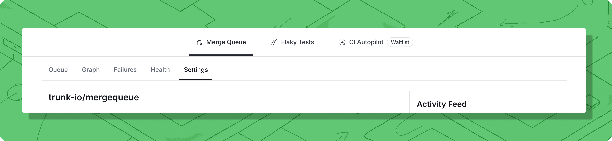

# Settings

All of the following settings are specific to individual Merge Queues and can be applied at [app.trunk.io](https://app.trunk.io/login?intent=merge%20queue) in the `Settings > Repositories > Repo-Name` page.

All of the following settings ar specific to individual Merge Queues and can be applied in the **Settings** tab.

<figure><figcaption>
Settings are also avilable under the <code>Settings > Repositories > Repo-Name</code> page.
</figcaption></figure>


Note that you must be an Organization admin to adjust any of these settings.


***

## Merge Queue State

You can change the state of your Merge Queue, which will affect behavior around PRs entering the queue and merging. PRs will always continue testing no matter what state the Merge Queue is in. Below are the possible different states:

<table data-full-width="true"><thead><tr><th>State</th><th>Will PRs Enter the Queue?</th><th>Will PRs Merge After Testing?</th><th>Example use case</th></tr></thead><tbody><tr><td><code>Running</code></td><td>Yes ✅</td><td>Yes ✅</td><td>Everyday merging: Protect your mainline and merges successful PRs.</td></tr><tr><td><code>Paused</code></td><td>No ❌</td><td>No ❌</td><td><strong>CI failure recovery</strong>: stop merges and testing in the queue until failure is resolved.</td></tr><tr><td><code>Draining</code></td><td>No ❌</td><td>Yes ✅</td><td><strong>Code freeze</strong>: merge PRs currently in the queue but don't start testing additional PRs.</td></tr></tbody></table>

There is an additional state `Switching Modes` that functions exactly like `Draining`. The Merge Queue enters this state when you switch the queue mode while PRs are still being tested.

### When to change merge queue state?

The `Running` state is the default state of your merge queue, and will be the normal, day-to-day state of your queue.

`Paused` is useful for CI incident response and failure recovery. For example, if there is a test infrastructure outage, a queue can be `Paused` until recovery is complete. The ordering of PRs in the queue is preserved, but no PRs are tested or merged.

`Draining` is useful for managing events like code freezes. PRs currently in the queue will be tested and merged, but no new PRs will start testing.

***

## Merge Queue Mode

> Merge Queues operate in one of two modes, **Single** or [**Parallel**](../concepts-and-optimizations/parallel-queues/)**.**&#x20;

**Single Queue** processes all pull requests in one line, testing each PR predictively against all changes ahead of it. This guarantees branch correctness but can increase wait times during high submission loads.

**Parallel Queues** dynamically creates multiple testing lanes based on each PR's impacted targets (the parts of the codebase it changes). PRs affecting different parts of the code can be tested simultaneously, reducing queue time while still preventing branch breaks. Requires PRs to report their impacted targets before processing. Read more about Trunks implementation of [Parallel merge queues](../concepts-and-optimizations/parallel-queues/).

***

## Testing Concurrency

> Testing concurrency can be set to any value, options are **5 (average)**, **25 (high)**, **50 (very high),** and **Custom**.

Configure how many PRs may be tested in parallel. A larger number may increase throughput since more PRs are tested in parallel, but at the expense of CI since more jobs are running in parallel. When the queue is at capacity, PRs will still be submitted to it, but they will not begin testing until a PR leaves the queue.


If your testing workload contains some flaky tests, a deeper queue (i.e., a higher concurrency) may struggle. Running Merge in Parallel mode can help with this, as it will reduce the average depth of your merge queue since all PRs won't be queued directly behind each other.


For example, assuming a concurrency of 3:

* At 12:00, Alice submits PR 1000 to the Merge Queue, and it starts testing.
* At 12:05, Bob submits PR 888 to the Merge Queue, and it starts testing.
* At 12:10, Charlie submits PR 777 to the Merge Queue, and it starts testing.
* At 12:15, Alice submits PR 1001 to the Merge Queue. Tests do not start because the Merge Queue is at its concurrency limit.

***

## Timeout for Tests to Complete

> Select the number of hours from the dropdown, default is **5 hours**.

Configure how long a PR's test can run before auto-cancelling while testing in the Merge Queue. If a long-running test is detected, Merge will automatically cancel the test.

For example, assuming a timeout of 4 hours:

* At 3:00, Bob submits PR 456 to the Merge Queue.
* At 3:05, PR 456 starts testing using Bob's CI system.
* At 7:05, Trunk cancels PR 456 since PR 456 is still testing.

***

## Optimistic Merge Queue

> Toggle this feature **On** or **Off**.

[**Optimistic Merging**](../concepts/optimistic-merging.md) allows multiple PRs to merge together when a later PR in the queue finishes testing first. Since that later PR's tests include all the changes ahead of it, the system can safely merge all verified PRs at once instead of waiting for each one individually, significantly reducing merge time.

***

## Pending Failure Depth

> Pending Failure Depth can be set to any value, options are **0**, **1**, **2**, **3**, and **Custom**.

[**Pending Failure Depth**](../concepts/pending-failure-depth.md) allows a failed PR to remain in the queue temporarily while a configurable number of PRs behind it complete testing. Since predictive testing means the failed PR's code is retested as part of later PRs, this gives flaky tests multiple chances to pass before the PR is evicted from the queue.

***

## Draft PR Creation

> Toggle this feature **On** or **Off**.

[**Draft PR Creation**](branch-protection-and-required-status-checks.md#draft-prs) determines whether Trunk Merge Queue creates draft PRs or push-triggered branches when testing changes. When enabled (default), the queue creates draft PRs to trigger your existing PR-based CI checks. When disabled, the queue creates `trunk-merge/` branches instead, requiring you to configure push-triggered workflows to run your required status checks.

***

## GitHub Comments

> Toggle this feature **On** or **Off**.

Whether or not GitHub comments are enabled for this merge queue.

<figure><figcaption></figcaption></figure>

***

## GitHub Commands

> Toggle this feature **On** or **Off**.

Whether or not GitHub slash commands like `/trunk merge` are enabled for this merge queue.

***

## Notifications

[Integrate Trunk Merge Queue with Slack ](../../integration-for-slack.md)to deliver real-time updates about your pull requests and queue status. You can configure notifications at two levels:&#x20;

* per-queue notifications sent to a Slack channel, or&#x20;
* per-user notifications sent as direct messages for PRs you authored.&#x20;

Customize which events trigger notifications, such as testing completion, failures, queue configuration changes, and successful merges.

***

## Batching

> Toggle this feature **On** or **Off**.

[**Batching**](../concepts/batching.md) tests multiple pull requests as a single unit instead of individually, dramatically reducing CI costs.&#x20;

***

## Delete Merge Integration


CAUTION: Any queued merge requests will not be merged and all data will be lost


This setting will delete the Merge Queue configuration and any queued merge requests will not be merged and all data will be lost.
