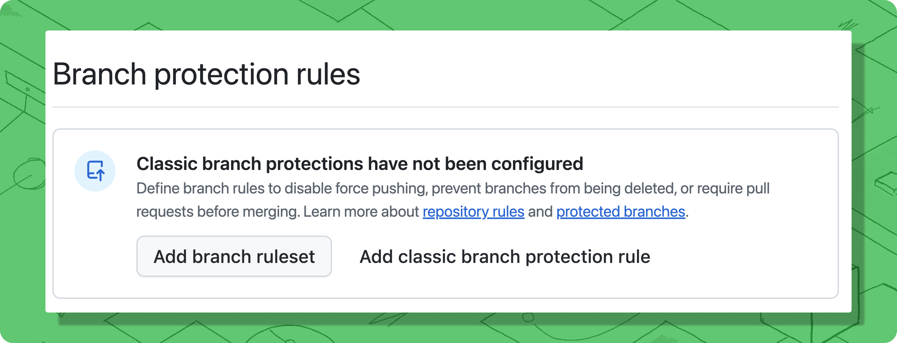

# Branch Protection & Required Status Checks

### Prerequisites <a href="#prerequisites" id="prerequisites"></a>

Before configuring branch protection, ensure you have:

* **Installed the Trunk GitHub App** in your repository. The `trunk-io` bot must have the necessary permissions to create branches, merge pull requests, and post status checks. See [GitHub App Permissions](https://docs.trunk.io/setup-and-configuration/github-app-permissions) for details.
* **Admin access** to your repository's settings to configure branch protection rules.

### How Trunk Merge Queue works

Trunk Merge Queue respects GitHub's branch protection rules and works with both Classic branch protection rules and Rulesets. Since Merge Queue ultimately merges pull requests through GitHub, any protection rules on your target branch (like required code reviews or status checks) will still apply.

### Choose your testing approach <a href="#choose-your-testing-approach" id="choose-your-testing-approach"></a>

Trunk Merge Queue can test pull requests in two ways. Choose the approach that fits your CI setup:

#### Draft PR mode (Recommended - Default) <a href="#draft-pr-mode-recommended---default" id="draft-pr-mode-recommended---default"></a>


**Best for:** Most teams who want the simplest setup with no additional configuration.


When a pull request enters the queue, Trunk creates a draft pull request to test the changes. This automatically triggers your existing pull request-based CI workflows—the same checks that run when you open a regular pull request.

**Advantages:**

* No additional CI configuration required
* Works immediately with your existing workflows
* Simple to set up and maintain

**When to use a different approach:** If you have expensive preview deployments, review-only workflows, or security scans that you don't want running during merge queue testing, consider Push-triggered mode instead.

#### Push-Triggered mode (Advanced) <a href="#push-triggered-mode-advanced" id="push-triggered-mode-advanced"></a>


**Best for:** Teams who need different CI behavior for merge queue testing versus pull request review.


When a pull request enters the queue, Trunk creates a `trunk-merge/*` branch and pushes to it. You configure specific CI jobs to run on these branches.

**Advantages:**

* Complete control over which jobs run during queue testing
* Avoid triggering expensive preview environments or review-only workflows
* Can optimize for faster merge queue throughput

**Requirements:**

* Configure push-triggered workflows in your CI provider for `trunk-merge/**` branches
* Define required status checks in your `.trunk/trunk.yaml` configuration file

**To enable:** Go to Settings > Repositories > select your repository > Merge > toggle off **Trunk Draft PR Creation**.

### Configure Branch Protection Rules <a href="#configure-branch-protection-rules" id="configure-branch-protection-rules"></a>

#### Using Rulesets vs. Classic Rules <a href="#using-rulesets-vs-classic-rules" id="using-rulesets-vs-classic-rules"></a>

You can use GitHub's Rulesets feature alongside Classic branch protection rules—both systems work together. However, **push permission restrictions must be configured using Classic branch protection rules only** because GitHub's API does not expose push restriction settings from Rulesets.

All other branch protection settings (required reviews, status checks, signed commits, etc.) can be configured using either Classic rules or Rulesets.

#### Configure Push Restrictions (Required) <a href="#configure-push-restrictions-required" id="configure-push-restrictions-required"></a>

Trunk Merge Queue needs permission to push to your protected branch. Configure these settings using Classic branch protection rules:

<figure><figcaption></figcaption></figure>

1. Go to **Settings > Branches** in your repository
2. Edit or create a Classic branch protection rule for your target branch (e.g., `main`)
3. Under "Rules applied to everyone including administrators," select:
   * **Restrict who can push to matching branches**
   * **Restrict pushes that create matching branches**
4. Add the `trunk-io` bot to the list of allowed actors
5. Optionally add Organization admins and repository admins who need emergency merge access
6. Save your changes


**Important:** Regular users should use [pull request prioritization](https://file+.vscode-resource.vscode-cdn.net/merge-queue/pr-prioritization) with `--priority=urgent` or `--priority=high` to fast-track pull requests through the queue while maintaining validation. Direct push access is only needed for rare emergencies where the queue itself must be bypassed.


#### Exclude Trunk's temporary branches (Critical) <a href="#exclude-trunks-temporary-branches-critical" id="exclude-trunks-temporary-branches-critical"></a>

Trunk Merge Queue creates temporary branches to test pull requests before merging them:

* `trunk-temp/*` - Temporary testing branches
* `trunk-merge/*` - Merge testing branches

**Trunk needs unrestricted access** to create, push to, and delete these branches. If your branch protection rules apply to these branches, Merge Queue cannot function.

**To verify and fix:**

1. Go to **Settings > Branches** in your repository
2. Review all Classic branch protection rules
3. Check for wildcard patterns like `*/*`, `**/*`, or similar that would match `trunk-temp/*` or `trunk-merge/*`
4. If you find matching rules, either:
   * **Option A:** Remove the wildcard rules and create more specific rules for your actual branches
   * **Option B:** Add the `trunk-io` bot to the bypass list for those rules

**Example of a problematic rule:** A branch protection rule with pattern `*/*` would protect all branches including `trunk-temp/*` and `trunk-merge/*`.

**What happens if these branches are protected:** Merge Queue will encounter GitHub permission errors and display messages like "Permission denied on trunk-merge/\* branch."

### Configure CI status checks <a href="#configure-ci-status-checks" id="configure-ci-status-checks"></a>

#### If using Draft PR mode (Default) <a href="#if-using-draft-pr-mode-default" id="if-using-draft-pr-mode-default"></a>

Your existing pull request-triggered CI workflows will automatically run when Trunk creates draft pull requests to test changes. **No additional configuration is required.**

Trunk will wait for the same required status checks configured in your branch protection rules (either via Classic rules or Rulesets) before merging.

See GitHub's documentation for configuring required status checks:

* [Classic branch protection rules](https://docs.github.com/en/repositories/configuring-branches-and-merges-in-your-repository/managing-protected-branches/about-protected-branches#require-status-checks-before-merging)
* [Rulesets](https://docs.github.com/en/repositories/configuring-branches-and-merges-in-your-repository/managing-rulesets/about-rulesets)

**You're done!** Skip to the Verification section below.

#### If using Push-Triggered mode <a href="#if-using-push-triggered-mode" id="if-using-push-triggered-mode"></a>

You need to complete two additional steps:

**Step 1: Configure Push-Triggered CI Workflows**

Set up your CI provider to run status checks whenever Trunk pushes to `trunk-merge/*` branches.

**Example for GitHub Actions:**

```yaml
name: Merge Queue Tests
run-name: Merge Queue Checks for ${{ github.ref_name }}

# Trigger when Trunk Merge Queue tests a pull request
on:
  push:
    branches:
      - trunk-merge/**

jobs:
  unit_tests:
    runs-on: ubuntu-latest
    name: Unit Tests
    steps:
      - name: Checkout
        uses: actions/checkout@v3
      
      - name: Run tests
        run: npm test  # Your actual test commands

  integration_tests:
    runs-on: ubuntu-latest
    name: Integration Tests
    steps:
      - name: Checkout
        uses: actions/checkout@v3
      
      - name: Run integration tests
        run: npm run test:integration  # Your actual test commands
```

**For other CI providers:** Configure workflows triggered by pushes to branches matching `trunk-merge/**`.

**Step 2: Define Required Status Checks in .trunk/trunk.yaml**

Create or edit your `trunk.yaml` file in a directory named `.trunk` at the root of your repository (so, `.trunk/trunk.yaml`)  to specify which status checks Trunk should wait for before merging:

```yaml
version: 0.1
merge:
  required_statuses:
    - Unit Tests
    - Integration Tests
```

**Important:** The status check names in `.trunk/trunk.yaml` must exactly match the job names from your CI workflows.

### Verification checklist

After completing configuration, verify your setup:

* [ ] `trunk-io` bot is added to push restrictions for your protected branch
* [ ] No branch protection rules apply to `trunk-temp/*` or `trunk-merge/*` branches
* [ ] If using Draft PR mode: Required status checks are configured in GitHub branch protection
* [ ] If using Push-triggered mode:
  * [ ] CI workflows trigger on `trunk-merge/**` branches
  * [ ] `merge.required_statuses` is defined in `trunk.yaml`

#### **Test your configuration**

1. Create a test pull request
2. Add the merge queue label or comment `/trunk merge` on the pull request
3. Check the [Trunk Dashboard](https://app.trunk.io/) to monitor your pull request status
4. The pull request should appear in the queue as "Queued" until all checks complete
5. Click on the pull request in the dashboard to see detailed status of what it's waiting for
6. You'll also see status updates in the comments on your pull request

**Expected behavior:** Your pull request should progress through testing and merge automatically once all required checks pass.

### Troubleshooting

<details>

<summary>"Permission denied on trunk-merge/* branch"</summary>

**Cause:** Branch protection rules are applying to Trunk's temporary branches.

**Solution:** Follow the "Exclude Trunk's Temporary Branches" section above to ensure `trunk-temp/*` and `trunk-merge/*` are not protected.

</details>

<details>

<summary>Pull request stuck as "Queued" in the queue</summary>

**Cause:** Required status checks are not completing or not configured correctly.

**Solution:**

* Click on the pull request in the Trunk Dashboard to see which checks it's waiting for
* Verify those checks are running in your CI provider
* If using Push-triggered mode, ensure the check names in `trunk.yaml` exactly match your CI job names

</details>

<details>

<summary>Required status checks not running</summary>

**If using Draft PR mode:** Verify your CI workflows are triggered by pull requests (including draft pull requests).

**If using Push-triggered mode:**

* Verify your CI workflows trigger on pushes to `trunk-merge/**` branches
* Check that the workflows actually ran in your CI provider's interface
* Ensure the `trunk-io` bot has permission to push to create these branches

</details>

#### Need help? <a href="#need-help" id="need-help"></a>

Visit [Trunk Support](../../support.md) for additional assistance or to contact the support team.
