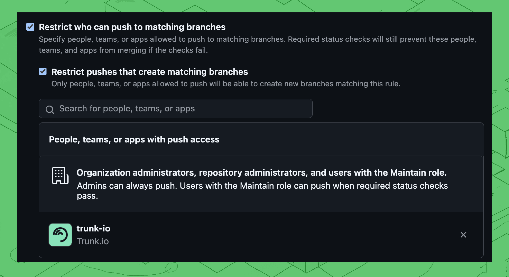

# Branch Protection & Required Status Checks

## Branch Protection

Trunk Merge Queue, since it will eventually merge your PR on GitHub, is still **bound by any protection rules set in GitHub** that affect the branch Trunk Merge Queue will merge into or that affect your Trunk Merge Queue branch. For example, if a PR requires at least one review to merge, then Trunk Merge Queue would display `'not mergable GitHub yet'` until that PR has a review.


Trunk Merge Queue does not work with GitHub's new [Rulesets](https://docs.github.com/en/repositories/configuring-branches-and-merges-in-your-repository/managing-rulesets/about-rulesets) and must be configured using "Classic branch protection rules"


If you have trouble with merge queueing PRs, check if there is any kind of additional branch protection set up on your repo. Existing branch protection rules must be changed in order to **not** protect branches in the form of `trunk-temp/*` and `trunk-merge/*` . If either of those branches is considered protected in any way according to GitHub (e.g., if there is a `*/*` branch protection rule), then Merge will not be able to run tests properly due to GitHub permission errors.


If there are any questions or help is needed, reach out on our questions or help is needed, reach out on our [community Slack](https://slack.trunk.io/)!


## Draft PRs

In some cases, you might not want every check that gets triggered when a PR gets created to run when testing PRs in the merge queue (e.g., you deploy your frontend on every PR so that reviewers can interact with it). In that case, if you prefer to use Trunk Merge Queue without Draft PRs, you can disable it by navigating to **Settings > Repositories >** selecting your repository **> Merge >** toggle **Trunk Draft PR Creation.**\
\
When draft PR creation is disabled, you will need to configure push-triggered workflows to run on branches to test each merge request. You can also configure custom gating for your PRs if you want to gate on a different set of checks for Trunk Merge Queue.

### Configure a Push Triggered Workflow For Required Status Checks

When creating Draft PRs is disabled, Trunk Merge Queue creates branches with the prefix `trunk-merge/` in order to test PRs. To ensure the required statuses Merge should gate on get triggered when it tests PRs, your CI provider must be configured to run the status checks you care about whenever a branch with that prefix is pushed to.


If you already have tests that trigger on new PRs, you can use the [Draft PR Creation](https://docs.trunk.io/merge-queue/set-up-trunk-merge/advanced-settings#draft-prs) feature to let Trunk Merge Queue create draft PRs instead of setting up a push-triggered workflow.


For GitHub Actions, that'll mean setting up a `push`-triggered workflow, filtered to `trunk-merge/**` branches, like so:

```yaml
name: Run Required Checks
run-name: PR Checks for ${{ github.ref_name }}

# Trigger jobs whenever Trunk Merge Queue tests a PR using a `trunk-merge/` branch
on:
  push:
    branches:
      - trunk-merge/**

jobs:
  trunk_check:
    runs-on: ubuntu-latest
    # "Trunk Check" is specified in merge.required_status above
    name: Trunk Check
    steps:
      - name: Checkout
        uses: actions/checkout@v3

  unit_tests:
    runs-on: ubuntu-latest
    # "Unit tests & test coverage" is specified in merge.required_status above
    name: Unit tests & test coverage
    steps:
      - name: Checkout
        uses: actions/checkout@v3

    # Add more steps here..    
```

## Define Required Status Checks For Testing

Trunk needs to know which _status checks_ must pass while testing pull requests in the queue before it can merge a PR into your branch. Merge can pick up this list of required statuses in one of two ways:



In automatic mode, the status checks specified in your branch's [GitHub branch protection](https://docs.github.com/en/repositories/configuring-branches-and-merges-in-your-repository/managing-protected-branches/about-protected-branches#require-status-checks-before-merging) rule will be used.

Trunk Merge Queue does not work with GitHub's new Rulesets. Make sure to click the **Add classic branch protection rule** link when configuring new rules.

<figure><figcaption></figcaption></figure>

See GitHub's doc for more information on configuring [required status checks](https://docs.github.com/en/repositories/configuring-branches-and-merges-in-your-repository/managing-protected-branches/about-protected-branches#require-status-checks-before-merging).



```
version: 0.1 
```

```
cli:
  version: 1.16.0
merge: 
  required_statuses:
    - Trunk Check 
    - Unit tests & test coverage
    # Add more required statuses here
```

\
Use custom when the status checks you want to enforce before merging do not match 1:1 with your GitHub branch protection rules. The names of the required\_statuses must match as specified on your [GitHub status checks](https://docs.github.com/en/pull-requests/collaborating-with-pull-requests/collaborating-on-repositories-with-code-quality-features/about-status-checks) or [jobs](https://docs.github.com/en/actions/learn-github-actions/understanding-github-actions#jobs)\
\
Custom `required_statuses` defined in the `.trunk/trunk.yaml` file take precedence over the GitHub required status checks from branch protection.



## Restricting Push permissions

Trunk needs access to push to protected branches, and works best alone. Add protections to restrict who can push to matching branches. In most cases, permissions should be restricted to Organization admins, repository admins and the `trunk-io` bot.

To update this configuration selecting your repository, navigate to **Settings** **> Branches >** your branch rule **> Edit >** toggle **Restrict who can push to matching branches and toggle  Restrict pushes that create matching branches**

Remove any existing configurations or special permissions for roles or groups and add an exception for the `trunk-io` bot only. Be sure to click **Save changes** to confirm the settings.

<figure><figcaption></figcaption></figure>
