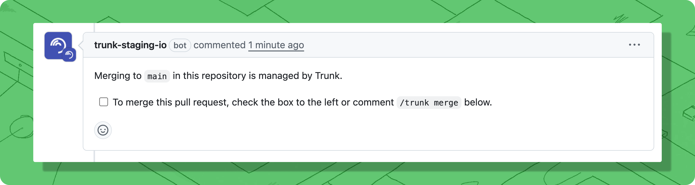

# Setup

This guide walks you through setting up Trunk Merge Queue for your repository. The setup process involves installing the GitHub App, creating a queue, and configuring branch protection rules to allow the merge queue to function properly.

#### Step 1: Install the GitHub App and Create a Queue


**The Trunk GitHub App is required for Merge Queue to function.** It grants Trunk Merge Queue the necessary permissions to create test branches, read CI results, and merge PRs in your repository. View [detailed permissions and what Trunk uses them for](../../setup-and-configuration/managing-your-organization/github-app-permissions.md).&#x20;


1. [Sign in to app.trunk.io](https://app.trunk.io/login) and navigate to the **Merge Queue** tab. (First-time users will [create an organization](../../setup-and-configuration/connecting-to-trunk.md) before accessing Merge Queue.)
2. Click the **Create New Queue** button.


If the GitHub App is already installed, step 3 will be skipped automatically.


3. If the Trunk GitHub App is not already installed, you'll be prompted to install it.&#x20;


**You must be a GitHub admin to complete the following steps.** If you are not a GitHub admin in your organization, go to `Settings` → `Team Members` to invite a GitHub admin to your Trunk organization so they can complete the following.

The GitHub App installation must be initiated from the Trunk web app to properly associate your Trunk organization with the GitHub App. If you have previously installed the Trunk GitHub App directly through GitHub, you'll need to uninstall it first and then reinstall it by starting the installation process from the Trunk web app as described below.


* Click **Install GitHub App** and follow the installation flow:
  * Select whether to install on all repositories or only specific ones
  * Review and approve the required permissions
  * Complete the installation
  * After the GitHub App installation is complete, you'll be returned to the Trunk dashboard.
  * In the Merge Queue tab click the "New Queue" button.&#x20;

4. Select a repository from the dropdown and enter the target branch to merge into. Click **Create Queue.**

<figure><figcaption></figcaption></figure>

### Step 2: Configure Branch Protection (Required)

The merge queue needs specific GitHub permissions to function. Follow the [Branch Protection & Required Status Checks](branch-protection-and-required-status-checks.md) guide to:

1. **Configure push restrictions** - Allow the `trunk-io` bot to push to your protected branch
2. **Exclude Trunk's temporary branches** - Ensure `trunk-temp/*` and `trunk-merge/*` branches are not protected


**Without proper branch protection configuration, the merge queue will not work.** You may see errors like "Permission denied on `trunk-merge/*` branch" or PRs will remain stuck in "Queued" state.



If you do not want every check that runs when a PR is opened to also run when Trunk Merge Queue tests PRs, you can disable draft PR creation and run tests on branches instead. See [Choose Your Testing Approach](branch-protection-and-required-status-checks.md#choose-your-testing-approach).


### Step 3: Test Your Setup

Now that branch protection is configured, test that the merge queue works correctly:

1. Create a test pull request in your repository
2. Submit it to the merge queue using one of these methods:
   * **Checking the box** in the Trunk bot comment on your PR, or
   * **Commenting** `/trunk merge` on the pull request

<figure><figcaption></figcaption></figure>


You can submit a PR to the merge queue at any time, even before CI checks pass or code review is complete. The PR will remain in "**Queued**" state until all required conditions are met, then automatically begin testing.


3. You can check the PR in the [Trunk Dashboard](https://app.trunk.io/) - once your PR passes all required checks, it will move from 'Queued' to 'Testing'. The merge queue will then test it again with changes ahead of it in the queue. When those tests pass, it will automatically merge.

#### Troubleshooting Common Issues


Visit [Trunk Support](../../support.md) for additional assistance or to contact the support team.


If your test PR doesn't merge automatically:

* **Check the status comments for the PR in** the [Trunk Dashboard](https://app.trunk.io/) to see what it's waiting for
* **Stuck in "Queued"**: Usually means branch protection rules haven't passed (missing required status checks or code review) or there are merge conflicts. If the status looks correct but the PR still won't enter the queue, try [removing](../managing-merge-queue/using-the-webapp.md#manually-restarting-failed-prs) and re-adding by commenting `/trunk merge` again on the PR.
* **Fails when attempting to merge**: Check that squash merges are enabled for your repository in GitHub settings (`Settings > General > Allow squash merging`). Trunk Merge Queue requires squash merges to be enabled.
* **"Permission denied" errors**: Review the [Branch Protection](branch-protection-and-required-status-checks.md#configure-branch-protection-rules) guide to ensure `trunk-temp/*` and `trunk-merge/*` branches aren't protected by wildcard rules like `*/*`.
* **Status checks not running**: Verify your CI is configured to run on draft PRs (or `trunk-merge/**` branches if using push-triggered mode). See the [Branch Protection](branch-protection-and-required-status-checks.md#configure-branch-protection-rules) guide for details.

### Step 4: Configure Advanced Features (Optional)

Once the basic merge queue is working, you can enable optimizations to improve performance:&#x20;

<table data-view="cards"><thead><tr><th align="center"></th><th data-hidden data-card-target data-type="content-ref"></th></tr></thead><tbody><tr><td align="center">Settings &#x26; Configurations</td><td><a href="advanced-settings.md">advanced-settings.md</a></td></tr><tr><td align="center">Branch Protection &#x26; Required Status Checks</td><td><a href="branch-protection-and-required-status-checks.md">branch-protection-and-required-status-checks.md</a></td></tr><tr><td align="center">Migrate from GitHub merge queue</td><td><a href="../migrating-from-github-merge-queue.md">migrating-from-github-merge-queue.md</a></td></tr><tr><td align="center">Batching</td><td><a href="../concepts/batching.md">batching.md</a></td></tr><tr><td align="center">Prioritization</td><td><a href="../pr-prioritization.md">pr-prioritization.md</a></td></tr><tr><td align="center">Flaky Test Protection</td><td><a href="../concepts/anti-flake-protection.md">anti-flake-protection.md</a></td></tr><tr><td align="center">Dynamic Parallel Queues</td><td><a href="../concepts-and-optimizations/parallel-queues/">parallel-queues</a></td></tr><tr><td align="center">Optimistic Merging</td><td><a href="../concepts/optimistic-merging.md">optimistic-merging.md</a></td></tr><tr><td align="center">Pending Failure Depth</td><td><a href="../concepts/pending-failure-depth.md">pending-failure-depth.md</a></td></tr></tbody></table>
