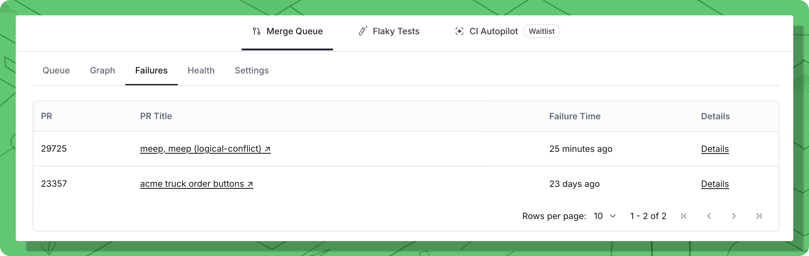
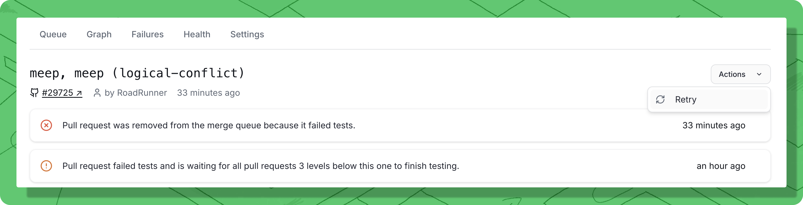

# Handle failed pull requests

### Understanding failures

When a PR fails in the merge queue, it's automatically removed so it doesn't block other PRs. Understanding why it failed helps you fix it quickly.

#### Why PRs fail in the queue

**Legitimate test failures (most common):**

* Tests fail because your code has a bug
* Tests fail due to conflicts with recently merged changes
* Tests fail because of missing or incorrect changes
* Integration tests reveal issues not caught locally

**Flaky tests:**

* Tests fail randomly, pass on retry
* Timing issues, race conditions, or external dependencies
* Network timeouts or resource contention
* See Anti-flake protection to handle these automatically

**GitHub/CI infrastructure issues:**

* GitHub API errors or rate limits
* CI runner out of resources or crashed
* Network connectivity problems
* Temporary infrastructure failures

**Configuration problems:**

* Branch protection rules misconfigured
* Required status checks not running
* Trunk unable to create test branches
* Missing CI configuration

**Merge conflicts:**

* Another PR merged and created conflicts
* Your branch needs to be rebased
* Files were moved or renamed

### Manually restarting failed pull requests

The PR Details panel has a dropdown "**Actions"** menu, where you can:

1. **Restart tests.** Use this to manually restart testing of this PR.
2. **Remove from queue**. If the PR is "Queued", then it will cancel it, preventing it from going into the queue until it is re-queued. If the PR is currently in the queue, it will be removed from the queue, which will restart all PRs that depended on it.

Trunk Merge Queue will automatically restart failed PRs when it can under certain conditions (see PR states). Since the restart is usually from a failed PR being removed from the queue, other PRs behind it will also be restarted. If you want to manually restart a PR, you can restart it _**in place**_ by clicking the **Details** link in the Failures summary screen to open the merge details screen. Then, click the **Actions** dropdown, and select **Restart**

<figure><figcaption></figcaption></figure>

There are a couple of reasons you might want to manually retry a PR. First, if a PR ends up in the `PENDING_FAILURE` state because of something transient like a CI runner disconnecting or flakey tests, you can retry the PR right away instead of waiting for PRs in front of it to pass or fail.

Another reason to restart a PR is if the proper tests don't get kicked off due to a failure in the CI system. For example, if GitHub has an outage and is not triggering workflows or actions properly.

***

## Failures

A tabulated view of all the items that have failed in the Merge Queue, e.g. due to testing.

<figure><figcaption></figcaption></figure>

### Retry failed pull requests

When a PR has been dropped from the queue, you can manually retry the PR by clicking the **Details** link in the Failures summary screen to open the merge details screen. Then, click the **Actions** dropdown, and select **Retry**

<figure><figcaption>
Re-queue a PR if it is currently not in the queue that has failed or been cancelled.
</figcaption></figure>
