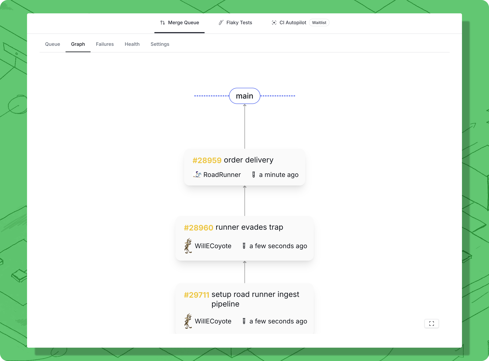

# Monitor queue status

### Access the Merge Queue dashboard

The Trunk Merge Queue dashboard gives you real-time visibility into your queue's activity.

**Access the dashboard:**

1. **Navigate to Trunk:** [https://app.trunk.io](https://app.trunk.io/)
2. **Select your organization** (if you're in multiple)
3. **Click** the **Merge Queue** tab in the upper left
4. Select your repository

**Quick access from GitHub:**

* Trunk bot comments include dashboard links
* Click any link in bot comments to go directly to that PR's status

### Queue overview

The main dashboard shows a high-level view of your merge queue activity.

<figure><figcaption>
Clicking on a queue item navigates you to the details page.
</figcaption></figure>

### Queue view

View status of the queue and recent activity in the **Queue** tab

#### **Active queue status:**

* **Currently testing**: Which PR is running tests right now
* **Queued PRs**: How many PRs are waiting
* **Merged**: List of previously merged PRs

#### **Activity feed:**

* PRs merged in the last 24 hours
* Success rate (percentage of PRs that passed tests)
* Average merge time
* Failed PRs requiring attention

### Graph view

The **Graph** tab provides a visual representation of all pull requests currently being tested by Trunk Merge Queue and their relationships within the queue. The graph surfaces batching, bisection, and dependency information at a glance so you can understand what the queue is doing at any moment.

<!-- TODO: Replace with new graph UI screenshot when available -->

<figure><figcaption>
The merge queue graph showing PRs progressing through testing and merging.
</figcaption></figure>

#### Reading the graph

Each **node** in the graph represents a pull request or a batch of pull requests. Each **edge** indicates a dependency: the connected PR is testing against the changes from the item above it. All edges point toward the target branch. As items merge, the affected queues automatically restructure.

* In **Single** mode, the graph displays as a single line showing the testing and merging process.
* In **Parallel** mode, multiple independent lanes are shown side by side.

#### Merged items

Pull requests that have successfully merged are displayed in the **green section at the top** of the graph, giving you immediate visibility into what has recently landed on the target branch.

#### Batch information on nodes

When [batching](../optimizations/batching.md) is enabled, graph nodes display batch information directly. You can see which PRs have been grouped together for testing. Clicking on a batched node navigates you to the actual PR that was opened for that batch test, so you can inspect CI results and logs.

#### Hover to trace path

Hovering over any item in the graph highlights the **full path from that item to the root** (target branch). This makes it easy to understand exactly which changes a given PR is being tested against and to trace its dependency chain through the queue.

#### Graph legend

The graph includes a **legend** that explains the meaning of each visual element, including node colors, edge types, and status indicators. Refer to the legend to understand what is happening in the queue at a glance.

#### Bisection tab

When a batch fails and [bisection](../optimizations/batching.md#bisection-testing-concurrency) is in progress, a **Bisection** side tab appears in the graph view. This tab shows the current state of the bisection process, including which sub-groups are being tested to isolate the failing PR. The bisection tab only appears when bisection is actively running.

#### Legacy graph view

To access the previous graph layout, use the **link at the top** of the graph page to switch to the legacy graph view.

#### Clicking on a PR

Click on any node in the graph to navigate to the [details page](#pull-request-details) for that PR, where you can see full test history, status, and available actions.

### Health view

Select a period of time to inspect using the **Period** dropdown (default 7 days) and a **Granularity** (defaults  to daily) of queue metrics

#### Conclusion counts

A Bar chart of PRs and their statuses. More Green = More Merges!

#### Time in queue

View statical trends of PR time in queue, default p50 view is useful for an "Average time in queue" evaluation.

## Pull request details

The PR details show information about a PR, including a link to the PR in GitHub, the history of the PR within Trunk Merge Queue, and what must be done before a PR can be admitted to the queue for PRs that have not entered the queue yet.

When a PR has not been admitted to the queue yet, Trunk Merge Queue waits for:

1. Impacted targets to be uploaded for the PRs current SHA (`Parallel` mode only)
2. The PR to be mergeable according to GitHub. If the PR is not mergeable yet, this most likely means that the PR is not meeting all branch protection rules you have set (for example, not all required status checks have passed yet) or has a merge conflict with the target branch
3. The target branch of the pull request to match the branch that merge queue merges into

<figure><figcaption>
PR readiness details for a PR that has been submitted but has not yet entered the merge queue.
</figcaption></figure>

In the screenshot above, the PR has been submitted to Merge but has not yet been added to the queue. It will be added once all of the branch protection rules pass and there are no merge conflics with the target branch.
