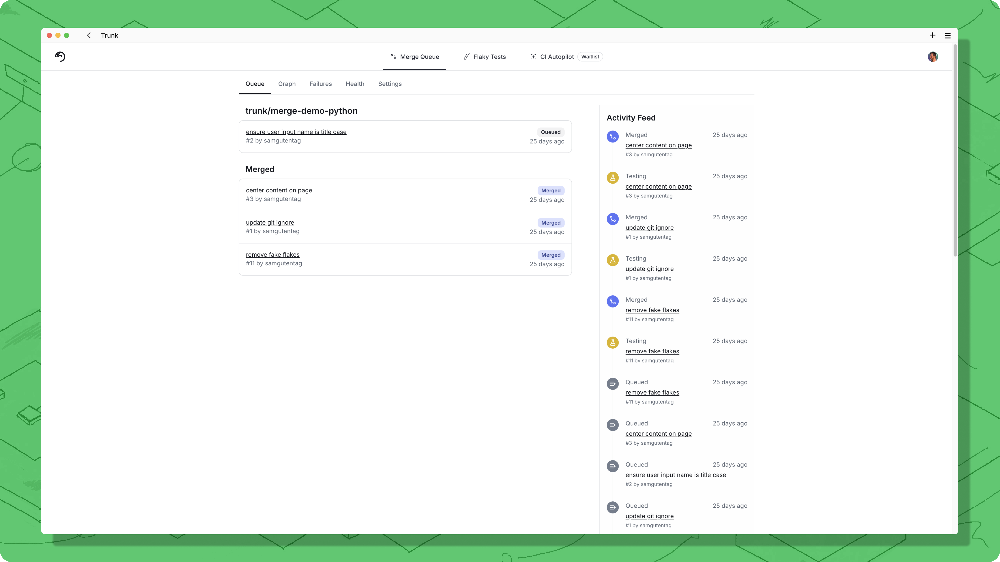

# Monitor queue status

### Access the Merge Queue dashboard

The Trunk Merge Queue dashboard gives you real-time visibility into your queue's activity.

**Access the dashboard:**

1. **Navigate to Trunk:** [https://app.trunk.io](https://app.trunk.io/)
2. **Select your organization** (if you're in multiple)
3. **Click** the **Merge Queue** tab in the upper left
4. Select your repository

**Quick access from GitHub:**

* Trunk bot comments include dashboard links
* Click any link in bot comments to go directly to that PR's status

### Queue overview

The main dashboard shows a high-level view of your merge queue activity.

<figure><figcaption>
Clicking on a queue item navigates you to the details page.
</figcaption></figure>

### Queue view

View status of the queue and recent activity in the **Queue** tab

#### **Active queue status:**

* **Currently testing**: Which PR is running tests right now
* **Queued PRs**: How many PRs are waiting
* **Merged**: List of previously merged PRs

#### **Activity feed:**

* PRs merged in the last 24 hours
* Success rate (percentage of PRs that passed tests)
* Average merge time
* Failed PRs requiring attention

### Graph view

The graph view shows all PRs currently being tested by Trunk Merge Queue and their relationships. Each node represents a pull request, and each edge indicates that the PR is testing with the item above and depends on it. All edges point towards the target branch; as items merge, the affected queues restructure. If running in `Single` mode, this will be a single line showing the testing and merging process.

#### Reading the graph

* **Merged items** appear in the green section at the top of the graph
* **Batched items** display batching information directly on each node. Clicking a batched node takes you to the draft PR created for that batch
* **Hover** over any node to highlight its path to the root, making it easy to trace dependencies
* **Bisection** activity appears in a side tab when a batch is being bisected to isolate a failure
* A **legend** explains the node states and visual indicators

#### Navigation

* Click any node to navigate to the PR's detail page
* A link at the top of the graph view lets you switch to the legacy graph layout if needed

#### Priority badges

PR nodes in the graph view display a priority badge when the PR was queued with a non-default priority:

* **Urgent** — a red pulsing badge labeled **URGENT**. Indicates the PR is interrupting in-progress testing.
* **High** — an orange badge labeled **HIGH**. The PR is fast-tracked ahead of normal-priority items.

PRs queued at the default medium priority or at low priority do not display a badge, keeping the graph view clean.

For details on setting priority levels, see [Priority merging](../../merge-queue/optimizations/priority-merging.md).

### Health view

Select a period of time to inspect using the **Period** dropdown (default 7 days) and a **Granularity** (defaults  to daily) of queue metrics

#### Conclusion counts

A Bar chart of PRs and their statuses. More Green = More Merges!

#### Time in queue

View statical trends of PR time in queue, default p50 view is useful for an "Average time in queue" evaluation.

## Pull request details

The PR details show information about a PR, including a link to the PR in GitHub, the history of the PR within Trunk Merge Queue, and what must be done before a PR can be admitted to the queue for PRs that have not entered the queue yet.

When a PR has not been admitted to the queue yet, Trunk Merge Queue waits for:

1. Impacted targets to be uploaded for the PRs current SHA (`Parallel` mode only)
2. The PR to be mergeable according to GitHub. If the PR is not mergeable yet, this most likely means that the PR is not meeting all branch protection rules you have set (for example, not all required status checks have passed yet) or has a merge conflict with the target branch
3. The target branch of the pull request to match the branch that merge queue merges into

<figure><figcaption>
PR readiness details for a PR that has been submitted but has not yet entered the merge queue.
</figcaption></figure>

In the screenshot above, the PR has been submitted to Merge but has not yet been added to the queue. It will be added once all of the branch protection rules pass and there are no merge conflics with the target branch.
