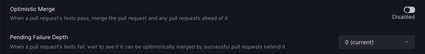

# Anti-Flake Protection

## Optimistic Merging

Sometimes, a pull request (PR) fails testing for reasons outside of the actual code change - [a test was flaky](../flaky-tests/), a CI runner was disconnected, and so on.  If a second PR that depends on the first **does** pass, then it is very likely that the first PR was actually good and simply experienced a transient failure.  In these cases, Merge can use **Optimistic Merging** to pass and merge both PRs.

With Optimistic Merging enabled, **Merge will allow failed tests to be merged only in the case where a following PR succeeds,** up to the limit of the [pending failure depth](anti-flake-protection.md#pending-failure-depth).\
\
Here is a short animation to describe how this works. In this case we are demonstrating optimistic merging with a pending failure set to at least 1.


anti-flake protection with optimistic merging + pending failure depth



Optimistic Merging only works when the [Pending Failure Depth](anti-flake-protection.md#pending-failure-depth) is set to **a value greater than zero**. When zero or disabled, Merge will not hold any failed tests in the queue.


## Pending Failure Depth

Normally a PR that fails will go into the **pending failure** state and will stay in the queue only if there are other PRs it depends on are also being tested. Once it's dependencies are complete the failed PR will be kicked out of the queue or restarted. _**Pending Failure Depth**_** allows a failed PR to wait in the queue for PRs that come after it** to finish testing before restarting or being kicked out of the queue. The number of PRs that the queue will wait for is the _Pending Failure Depth._  This depth is configurable and reflects the number of **levels** Merge will wait to finish testing.&#x20;

For example, if you have a parallel queue that looks like this:

```
                    <- B (pending)
main <- A (testing) 
                    <- C (pending)
```

If _pending failure depth_ is set to `1` and `A` fails, Merge will wait until both `B` and `C` finish testing before retrying or kicking `A` out of the queue.

Pending Failure Depth works very well with [Optimistic Merging](anti-flake-protection.md#optimistic-merging) - it gives a chance for a failed PR to be optimistically merged, as we’ll wait for PRs after it to finish testing. This gives great protection against flaky tests as you can make merge wait to see if it will have a chance to optimistically merge a PR further down the line. This feature can still be used without optimistic merging, but without it, a restart or PR getting kicked from a failure is still inevitable - you just now have additional time to go see why the PR failed and if you should manually restart it or not.

### Enabling&#x20;

**Optimistic Merge** can be turned on in the [Merge UI](using-the-webapp.md):

<figure><figcaption></figcaption></figure>

**The Fine Print**\
There is a small tradeoff to be made when optimistic merging is used. You can get into a situation where an actually broken test in say change 'B' is corrected by a change in 'C'. In this case if you later reverted 'C' your build would be broken.&#x20;
