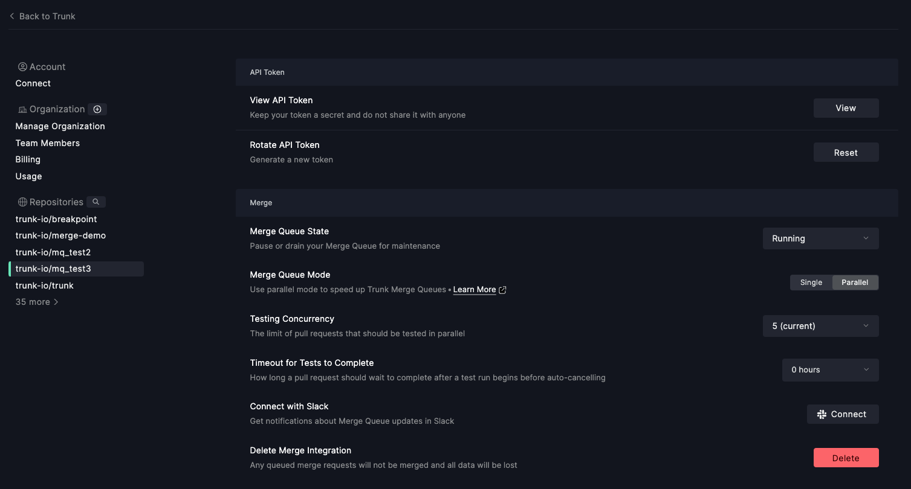

# Configuration

We offer some knobs and dials when configuring Merge. All of the following settings are specific to individual Merge Queues, and can be applied can be applied at [app.trunk.io](https://app.trunk.io) in the `Settings > Repositories > Repo-Name` page.

## Merge Queue States

You can change the state of your Merge Queue, which will affect behavior around PRs entering the queue and merging. PRs will always continue testing no matter what state the Merge Queue is in. Below are the possible different states:

<table><thead><tr><th width="149">State</th><th>Will PRs Enter the Queue?</th><th>Will PRs Merge After Testing?</th></tr></thead><tbody><tr><td><code>Running</code></td><td>Yes ✅</td><td>Yes ✅</td></tr><tr><td><code>Paused</code></td><td>No ❌</td><td>No ❌</td></tr><tr><td><code>Draining</code></td><td>No ❌</td><td>Yes ✅</td></tr></tbody></table>

There is an additional state, `Switching Modes`, that functions exactly like `Draining`. The Merge Queue enters this state when you switch the mode of the queue while PRs are still testing.

## Single / Parallel Mode 

Merge can support two different modes - `Single` and `Parallel` mode. The mode affects how PRs are enqueued when they enter the queue and what is required for a PR to begin testing.

#### Parallel Mode

In this mode, Trunk Merge will dynamically create new merge queues for PRs that affect different parts of your code base. To support this, you will be required to provide a list of impacted targets that result from code changes in the PR (see [impacted-targets.md](impacted-targets.md "mention") for more details as well as how to generate the list of impacted targets). Trunk Merge will then examine the provided list of impacted targets for all PRs in the existing merge queues and only make your PR depend in the other PRs it actually affects.

For example, the following PRs:

* PR 1 with impacted target list `[src/protos/]`
* PR 2 with impacted target list `[src/user_service/, src/protos/]`
* PR 3 with impacted target list `[docs/]`

would be split into two different queues in `Parallel` mode

<figure><figcaption></figcaption></figure>

#### Single Mode

In this mode, PRs will always be queued directly behind one another in a first-in first-out fashion, regardless of what parts of code your PR actually affects. Uploading impacted targets is not required in this mode.

For example, the above 3 PRs would look like this in the Merge Queue in `Single` mode

<figure><figcaption></figcaption></figure>

#### Switching Modes

Merge can be swapped between `Single` and `Parallel` mode at any time. If there are no PRs in the merge queue when switching, the switch will be immediate. If there are PRs in the queue, then Merge will go into the `Switching Modes` state, where it'll wait for all currently testing PRs to merge before switching modes. During this time, PRs will not be able to enter the queue.

Switching modes can be done from the `Merge Queue Mode` section of the `Settings > Repositories > repo name > Merge` panel

<figure><figcaption>
enabling parallel mode
</figcaption></figure>

### Timeout for Tests to Complete

Configure how long a PR's test can run before auto-cancelling while testing in the Merge Queue. If a long-running test is detected, Merge will automatically cancel the test.


If you're unsure about what timeout to set, you can use our [CI Analytics](https://trunk.io/products/ci-analytics) to analyze the runtime of your CI.


For example, assuming a timeout of 4 hours:

* At 3:00, Bob submits PR 456 to the MergeQueue.
* At 3:05, PR 456 starts testing using Bob's CI system.
* At 7:05, Trunk cancels PR 456, since PR 456 is still testing.

### Concurrency

Configure how many PRs may test in parallel. A larger number may increase throughput, since more PRs are tested in parallel, but at the expense of CI, since more jobs are running in parallel. When the queue is at capacity, PRs will still be submitted to it, but they will not begin testing until a PR leaves the queue.


If your testing workload contains some flaky tests, a deeper queue (i.e. a higher concurrency) may struggle. Running Merge in Parallel mode can help with this, as it will reduce the average depth of your merge queue, since all PRs won't be queued directly behind each other.


For example, assuming a concurrency of 3:

* At 12:00, Alice submits PR 1000 to the MergeQueue, and it starts testing.
* At 12:05, Bob submits PR 888 to the MergeQueue, and it starts testing.
* At 12:10, Charlie submits PR 777 to the MergeQueue, and it starts testing.
* At 12:15, Alice submits PR 1001 to the MergeQueue. Tests do not start, because the MergeQueue is at its concurrency limit.
