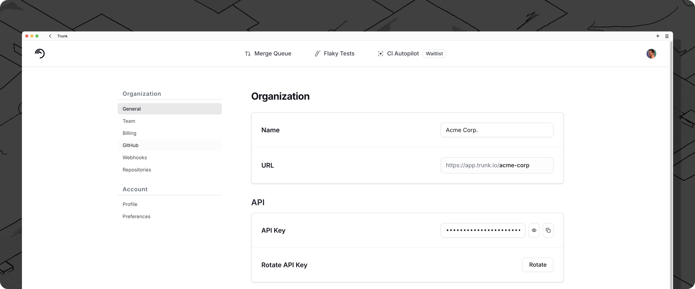
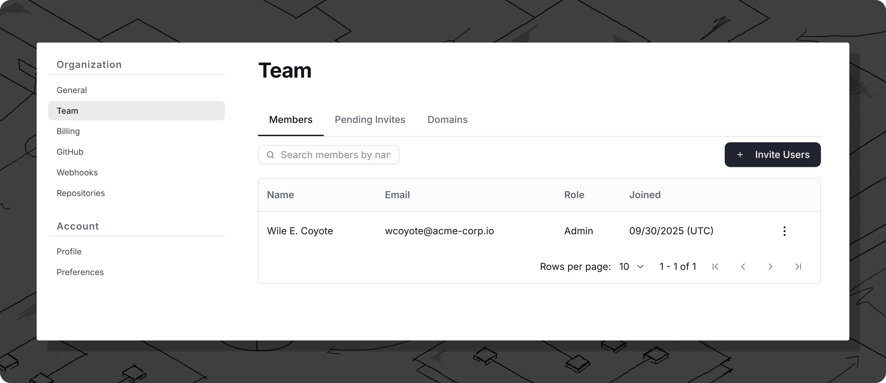
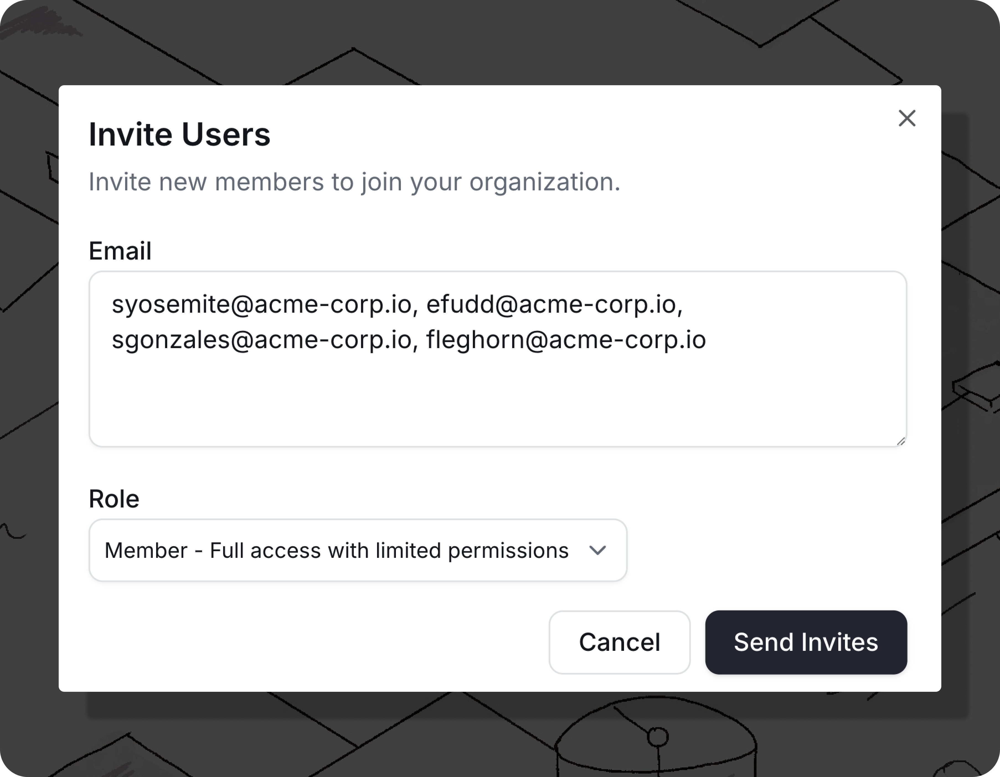
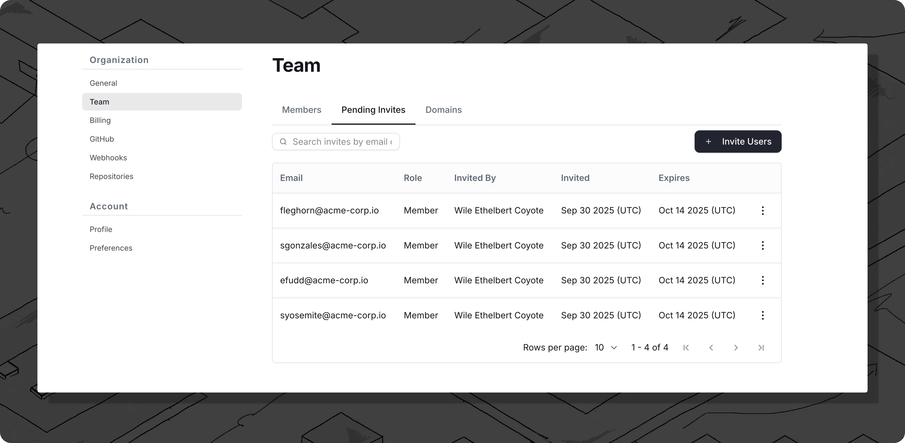
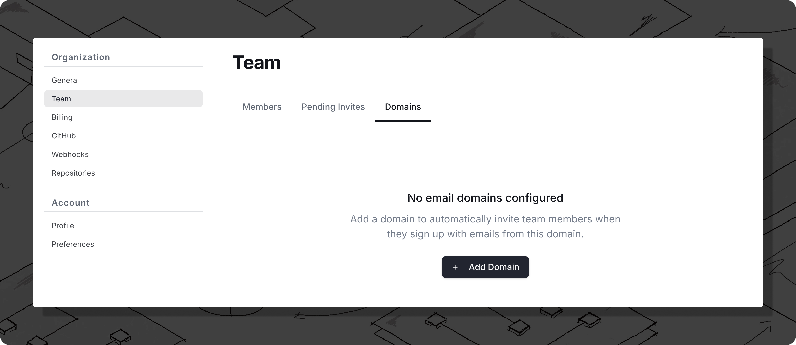

# Managing your Organization

## Organization Slug and Token

Integrating with Trunk through [Webhooks](../flaky-tests/webhooks/), [APIs](apis/), or [CLI](/broken/pages/OJc6wVrAfc2SLQZlJ2m1) will require authentication using your organization's slug and token.

You can find your organization slug and token by going to **Settings** > **Organization** > **General**.

<figure><figcaption></figcaption></figure>

***

## Managing Team Members

You can manage a team member's role and remove team members by navigating to **Settings** > **Organization** > **Team** > **Members** and clicking on the name of a team member. You can change the role of a team member between user and admin, as well as removing the user from your organization.

<figure><figcaption></figcaption></figure>

### Inviting Team Members

You can invite individual members manually by navigating to **Settings** > **Organization** > **Team** > **Members** and clicking the **Invite Users** button. An email will be sent to the invitee's inbox.

In the form, add comma separated email addresses and select a Role from the drop down. This role will be applied to all users in this invite batch.

Available Roles are:

* **Member**: Full access with limited permissions (default)
* **Admin**: Full administrative access

<figure><figcaption></figcaption></figure>

### Pending Invites

You can view and manage pending email invites by navigating to **Settings** > **Organization** > **Team** > **Pending Invites**.

From this page you can copy the member invite link or revoke the invite using the **three dots** menu.

<figure><figcaption></figcaption></figure>

### Team Domains

If your team uses emails managed by Google or Microsoft under a common domain, you can grant access to your team using **Team Domains**. When a team member creates a Trunk account with an email under you configured team domain, they will be granted access to your Trunk organization and repositories.

You can enable team domains under **Settings > Organization > Team > Domains** and clicking **Add Domain**.



<figure><figcaption></figcaption></figure>



<figure><figcaption></figcaption></figure>




Trunk also supports SSO login. If you wish to use SSO, please contact us at support@trunk.io.

