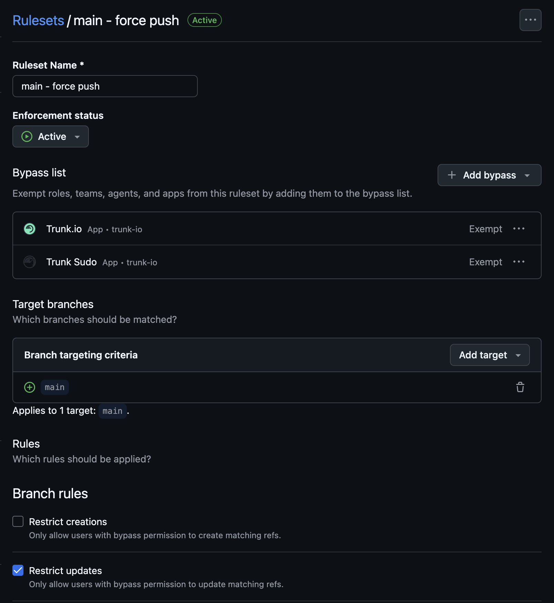
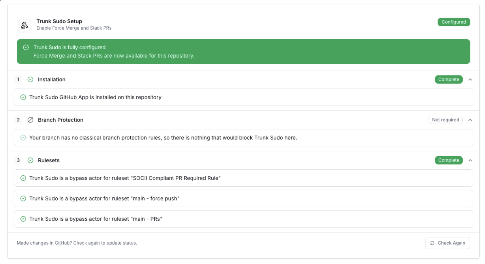

# Trunk Sudo GitHub App

Trunk Sudo is a second Trunk GitHub App, separate from the [main Trunk GitHub App](github-app-permissions.md). Its only purpose is to programmatically merge pull requests while bypassing GitHub branch protections, on behalf of Trunk features that need that capability.

Trunk Sudo is a shared prerequisite for bypass-dependent features. Today it powers [Force merge](../merge-queue/using-the-queue/force-merge.md) and [stacked pull requests with `/trunk stack`](../merge-queue/using-the-queue/stacked-pull-requests.md#merge-the-stack-as-one-unit).


**Trunk Sudo is optional.** You only need to install it if you plan to use a feature that requires it. If you don't use any bypass-dependent features, you can skip this setup.


### Prerequisites

Before you begin, make sure you have:

* [ ] Admin access to your GitHub organization
* [ ] The [main Trunk GitHub App](github-app-permissions.md) already installed
* [ ] Branch protection already configured for your merge branch (classic rules, rulesets, or both)

### Install the Trunk Sudo GitHub App

You can install Trunk Sudo from either the Trunk web app or directly on GitHub — both paths land at the same GitHub install flow.

1. **From the Trunk web app (recommended):** Navigate to your repository's **Merge Queue** settings page. The Trunk Sudo setup panel includes an **Install** button that opens GitHub's install flow.
2. **Directly on GitHub:** Go to [https://github.com/apps/trunk-sudo](https://github.com/apps/trunk-sudo) and click **Install**.

In the GitHub install flow:

1. Select whether to install on all repositories or only specific ones. You must include every repository where you want to use a bypass-dependent feature.
2. Review and approve the required permissions (see [Permissions reference](#permissions-reference) below).
3. Complete the installation.

### Configure branch protection for Trunk Sudo

Installing the app isn't enough on its own — your branch protection configuration must also allow Trunk Sudo to bypass the relevant rules when it merges. GitHub has two systems for branch protection: **classic branch protection rules** and **rulesets**. Both can coexist on the same branch.

**Rulesets are strongly recommended.** Classic branch protection has rules that cannot be bypassed by any GitHub App (notably required status checks and "Require branches to be up to date"), so using classic protection alone will block Trunk Sudo from merging. Rulesets don't have this limitation.

#### Option A — GitHub Rulesets (recommended)

In GitHub, navigate to **Settings → Rules → Rulesets**. For every active ruleset that applies to your merge branch:

1. Open the ruleset.
2. Under **Bypass list**, add the **Trunk Sudo** GitHub App.
3. Set its bypass mode to **Exempt**.
4. Save.

<figure><figcaption>Trunk Sudo's bypass mode must be Exempt.</figcaption></figure>


**This is the most common setup mistake.** When you add an actor to a ruleset's bypass list, GitHub defaults the bypass mode to **Always** — which sounds like it covers everything but does not cover pull request merges. Trunk Sudo must be set to **Exempt**; it's the only mode that lets a GitHub App merge a PR without interactive confirmation. If Trunk Sudo isn't set to Exempt, merges will silently fail.


#### Option B — Classic branch protection

If you're using classic branch protection rules, navigate to **Settings → Branches → Branch protection rules** and edit the rule for your merge branch.

1. If **"Require a pull request before merging" → "Require approvals"** is enabled, enable **"Allow specified actors to bypass required pull requests"** and add **Trunk Sudo** to the allow list.
2. If **"Restrict who can push to matching branches"** is enabled, add **Trunk Sudo** to the allowed actors list.
3. Remove any entries under **"Require status checks to pass before merging"**. Classic branch protection does not allow apps to bypass required status checks.
4. Disable the nested **"Require branches to be up to date before merging"** checkbox. This setting also cannot be bypassed on classic protection.


**Classic branch protection has unbypassable rules.** Required status checks and "Require branches to be up to date" cannot be bypassed by any GitHub App. If you need those protections, move the rule to a ruleset with Trunk Sudo listed as an exempt bypass actor — otherwise Trunk Sudo will be unable to merge.


### Verify your setup

The Trunk Merge Queue settings page includes a live checklist that validates every piece of the Trunk Sudo configuration end-to-end. **This checklist is the source of truth for whether your setup is correct** — if the checklist is green, the app is ready to merge.

<figure><figcaption>Trunk Sudo setup checklist in the Merge Queue settings page when everything is configured properly.</figcaption></figure>

Each row shows the status of one check (installation, classic branch protection, and one row per active ruleset on the merge branch). If a row is red, revisit the corresponding section above — the check IDs map directly to the configuration surfaces described here.

### Permissions reference

Trunk Sudo requests the following repository permissions. Each one is required for a specific part of the merge bypass flow.

#### Administration (Read-only)

This permission includes read-only access to repository settings, teams, and collaborators.

Trunk Sudo uses this permission to read your current branch protection and ruleset configuration so it can determine whether it is correctly set up to bypass protections before attempting a merge.

#### Metadata (Read-only)

This permission includes access to search repositories, list collaborators, and access repository metadata.

This permission is required by all GitHub applications that access repository information.

#### Contents (Read and write)

This permission includes access to repository contents, commits, branches, downloads, releases, and merges.

Trunk Sudo uses this permission to merge pull requests into your merge branch.

#### Pull requests (Read and write)

This permission includes access to pull requests and merges.

Trunk Sudo uses this permission to read PR state and to complete the merge operation.

#### Workflows (Read and write)

This permission includes access to update GitHub Action workflow files.

Required so Trunk Sudo can merge PRs that modify files under `.github/`. GitHub blocks any merge that touches workflow files unless the merging actor has this permission.

### Features that use Trunk Sudo

* [Force merge](../merge-queue/using-the-queue/force-merge.md) — admins push a PR through Merge Queue even when branch protection isn't satisfied.
* [Stacked pull requests with `/trunk stack`](../merge-queue/using-the-queue/stacked-pull-requests.md#merge-the-stack-as-one-unit) — combine a chain of dependent PRs into a single stacked PR that moves through the merge queue as one unit.

### Next steps

→ [**Force merge**](../merge-queue/using-the-queue/force-merge.md) — use the Trunk Sudo app to merge PRs through the queue that don't satisfy branch protection.

→ For the main Trunk GitHub App and its permissions, see [Trunk GitHub App](github-app-permissions.md).
