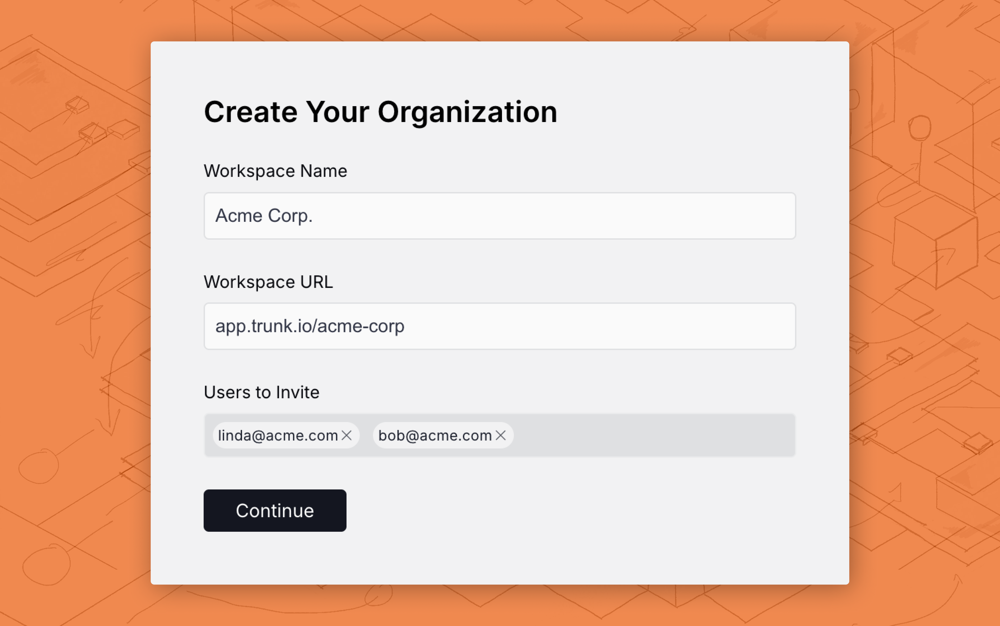
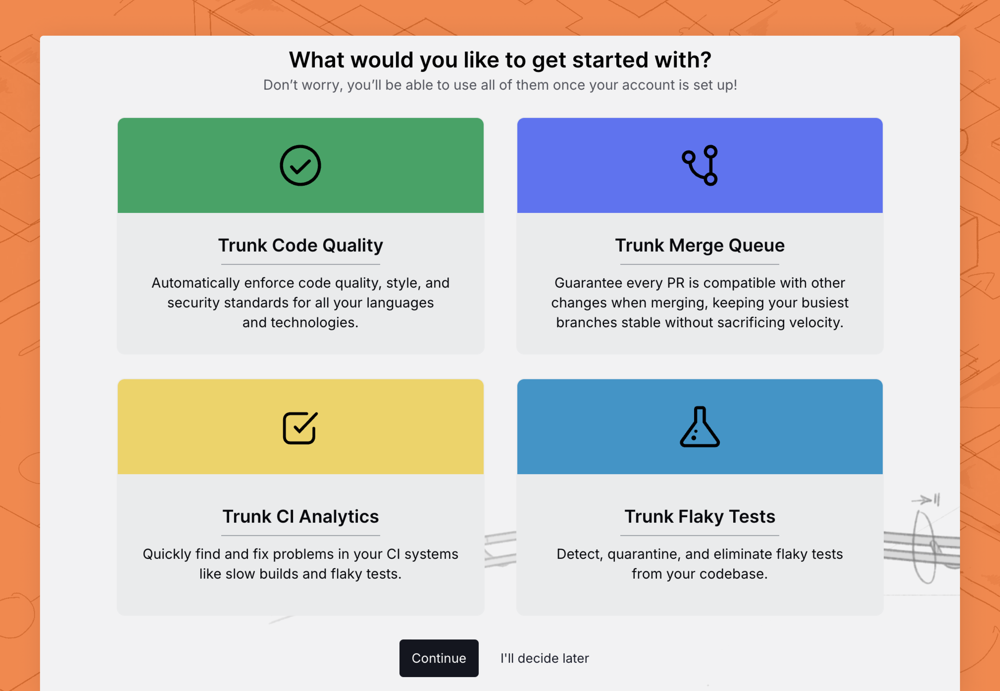

# Connecting to Trunk

### Create a Trunk Account

Welcome to Trunk! Before you can access Trunk's toolkit to ship faster, you must [create a Trunk account](https://app.trunk.io/signup). You can connect to Trunk in two ways:

* Connect with OAuth using your Google, GitHub, or Microsoft account.
* Connect with SSO through your organization's email. To configure SSO for your organization, please [contact us](mailto:support@trunk.io) or [join us on Slack](https://slack.trunk.io/).

### Create an Organization

After creating a Trunk Account, you'll be invited to [create an organization](https://app.trunk.io/onboarding). Organizations are shared workspaces for your team, and **individual repositories** connected to Trunk will fall under your team's organization.

<figure><picture><source srcset="../.gitbook/assets/onboarding-create-org-dark.png" media="(prefers-color-scheme: dark)"></picture><figcaption></figcaption></figure>

To create your organization, you need the following:

* Workspace Name: This is the display name of your organization. This can be changed later.
* Workspace URL: This is the link to access your workspace and also your [Organization Slug](managing-your-organization/#slug). This cannot be changed.
* Users to Invite: Invite your team to your organization by email. You can[ invite and manage members](managing-your-organization/#inviting-team-members) later in your organization's settings.


**Trying to join your team?**

If your team is already on Trunk and you're looking to join an existing organization, see the docs on[ inviting team members](managing-your-organization/#inviting-team-members) and contact an organization admin.&#x20;


### Start Using Trunk

After connecting to Trunk, you're ready to get started. Following the [guided onboarding](https://app.trunk.io/onboarding) experience for the feature you'd like to try first.

<figure><picture><source srcset="../.gitbook/assets/onboarding-pick-product-dark.png" media="(prefers-color-scheme: dark)"></picture><figcaption></figcaption></figure>

### Next Steps

<table data-card-size="large" data-view="cards"><thead><tr><th></th><th data-hidden data-card-cover data-type="files"></th><th data-hidden data-card-target data-type="content-ref"></th></tr></thead><tbody><tr><td><h4>Flaky Tests</h4></td><td><a href="../.gitbook/assets/FlakyTests.png">FlakyTests.png</a></td><td><a href="../flaky-tests/overview.md">overview.md</a></td></tr><tr><td><h4>Code Quality</h4></td><td><a href="../.gitbook/assets/CodeQuality.png">CodeQuality.png</a></td><td><a href="../code-quality/overview/">overview</a></td></tr><tr><td><h4>Merge Queue</h4></td><td><a href="../.gitbook/assets/Merge.png">Merge.png</a></td><td><a href="../merge-queue/merge-queue.md">merge-queue.md</a></td></tr><tr><td><h4>CI Analytics</h4></td><td><a href="../.gitbook/assets/CIAnalytics.png">CIAnalytics.png</a></td><td><a href="../ci-analytics/ci-analytics.md">ci-analytics.md</a></td></tr><tr><td><h4>Install the CLI</h4></td><td></td><td><a href="../references/cli/">cli</a></td></tr><tr><td><h4>Manage your Organization</h4></td><td></td><td><a href="managing-your-organization/">managing-your-organization</a></td></tr></tbody></table>

