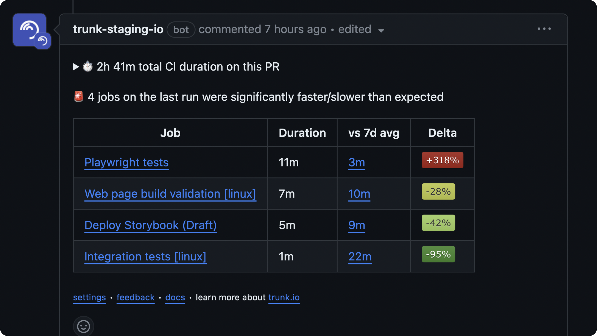

# Tools

**Trunk Tools is a hermetic runtime and CLI tool manager. Seamlessly specify, install, and upgrade the tooling in your repository with Trunk Tools.**

#### Command Line

| trunk tools `<command>`        | description                                                                    |
| ------------------------------ | ------------------------------------------------------------------------------ |
| list                           | list all available tools in the repository and whether they are enabled or not |
| install                        | install your enabled tools into `.trunk/tools`                                 |
| enable `<tool-name>[@version]` | enable the provided tool, optionally at a specified version                    |
| disable `<tool-name>`          | disable the provided tool                                                      |

#### Discovering Tools

The trunk [plugins](https://github.com/trunk-io/plugins) repo ships with a collection of tools that can help supercharge your repository and provide examples for how to write your own. To see a list of tools that you can enable in your own repo run:

```shell
trunk tools list
```


<figure><figcaption><p>list of available and enabled tools</p></figcaption></figure>

#### Running Tools

`Trunk` installs your enabled tools into the `.trunk/tools` directory. Each tool exposes as list of **shims** (these may or may not be identically named to the tool - most typically a tool has one shim matching the name of the tool). Each shim is installed into the `.trunk/tools` directory.

You can run your tools by referring to the path `<path to your workspace>/.trunk/tools/<shim name>` but this is unwieldy. We highly recommend using [direnv](https://direnv.net/) in your repository and adding the following line to your `.envrc` -

```
PATH_add .trunk/tools
```

This way, whenever you're insider your repo at the command line, you can just run shims installed by `trunk tools` directly by name.
